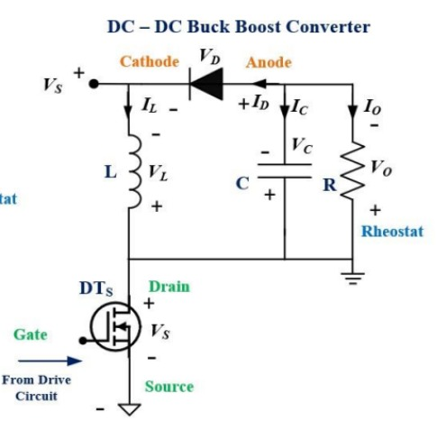

# 🔋 Buck-Boost Converter

> A complete design, simulation, and hardware implementation of a Buck-Boost DC-DC converter

## 📘 Overview

This project demonstrates the development of a **Buck-Boost Converter** capable of stepping up or stepping down a DC input voltage to maintain a desired output voltage. It finds applications in battery-powered and embedded systems where input voltages can fluctuate.

The project includes:
- Circuit design and simulation using **MATLAB Simulink**
- PCB design using **EasyEDA**
- Hardware fabrication and real-world testing at the **Makerspace Lab and EMPEL , IIT Indore**

---
> 
> 
## 🛠️ Components Used

| Component            | Description                     |
|----------------------|---------------------------------|
| IRFZ44NPbF           | Power MOSFET                    |
| QH08TZ600            | Power Diode                     |
| TL494                | PWM Controller IC               |
| TC4428               | MOSFET Driver                   |
| 2324-RC              | Inductor                        |
| 470 µF Capacitor     | Output Filter Capacitor         |
| Rheostat             | Variable Load                   |
| DC Power Supply      | Input Source                    |

---

## 🧪 Experimental Results

### Case 1
- **Vin = 15 V**, **D = 0.5**, **RLoad = 16 Ω**
- **Measured Vout** = -13 V
- **Ideal Expected Vout** = -15 V
- **Diode Current** ≈ 736 mA  

### Case 2
- **Vin = 15 V**, **D = 0.55**, **RLoad = 27.8 Ω**
- **Measured Vout** = -15.7 V
- **Ideal Expected Vout** = -18.3 V 
- **Diode Current** ≈ 552 mA  

### Case 3
- **Vin = 15 V**, **D = 0.6**, **RLoad = 28.9 Ω**
- **Measured Vout** = -19.6 V
- **Ideal Expected Vout** = -22.5 V  
- **Diode Current** ≈ 583 mA  

### Boundary and Discontinuous Conduction Modes
- **BCM** observed around **1.5 kHz**
- **DCM** observed around **1 kHz**

---

## 🖼️ PCB Design

The circuit was designed using **EasyEDA** and fabricated at the **Makerspace Lab, IIT Indore**. Additional berg pins were added for waveform measurements (inductor voltage and diode current).

---

## ✅ Conclusion

This project provided deep insight into:
- Practical implementation of power electronics concepts
- Simulation-hardware correlation
- Challenges in designing real-world converters

The integration of MATLAB Simulink with hardware testing greatly improved understanding and accuracy.

For more information and waveforms obtained during test check out our report!

